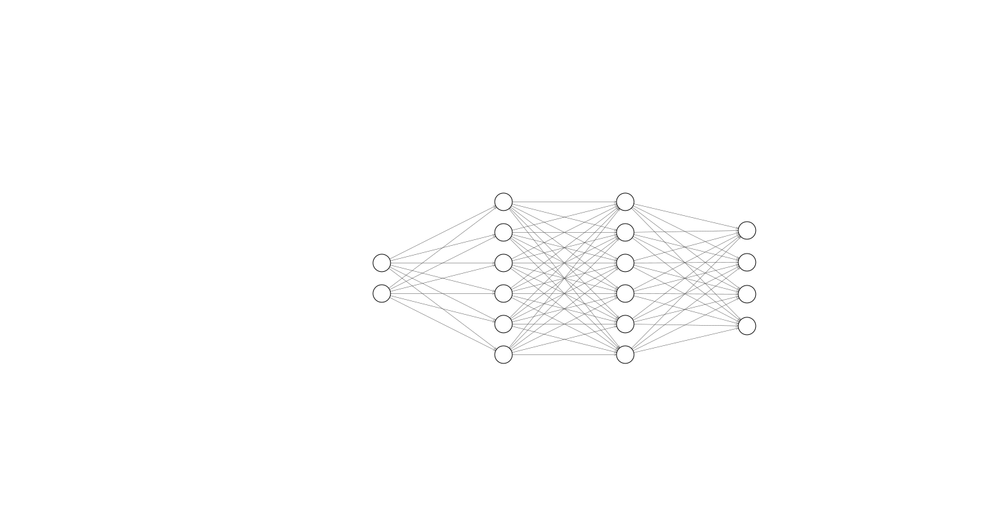

To train an agent to play chrome dino game perfectly, used genetic algoritm and neural networks. 

The neural network architecture has 1 input layer, 2 hidden layers and 1 output layer. There are 2 inputs which are distance between dino and cactuses and distance between dino and birds.

### Setup
- Create a Unity Project
- Add all files to Assets
- Double click to game scene in Scenes folder
- If you want to change how many birds generate in each generation, you can easily change the noOfBirds parameter in Controller.cs file, or clicking to AI game object in Hierarchy window you will see noOfBirds part.
- Then you can start the game to train the agent
