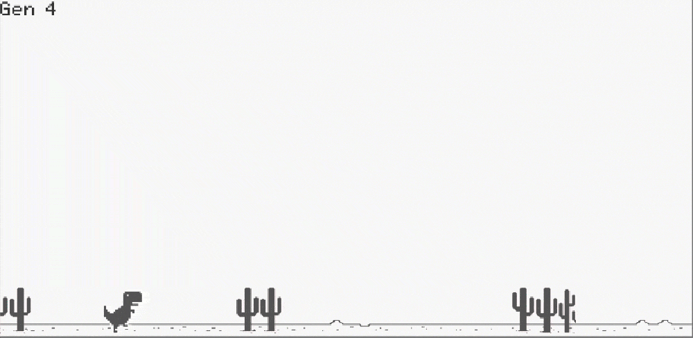
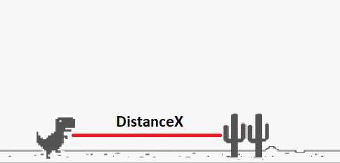
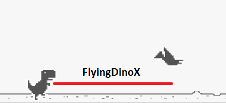

To train an agent to play chrome dino game perfectly, used genetic algoritm and neural networks. 

-----------------------------

#### First Input

#### Second Input

The neural network architecture which has an input layer, 2 hidden layers and 1 output layer, is used for brain of each dino. There are 2 inputs which are distance between dino and cactuses, distance between dino and birds. Also there are 4 outputs which are jump, noJump, slide, noSlide.

When jump is higher than noJump, dino will jump on the cactus and when slide is higher than noSlide, dino will slide under the birds.

### Setup
- Create a Unity Project
- Add all files to the project
- Double click on main scene in Scenes folder
- If you want to change how many dinos generate in each generation, you can easily change the noOfDinos parameter in AI.cs file, or clicking to Neuroevolution game object in Hierarchy window, you will see noOfDinos part.
- Then you can start the game to train the agent
